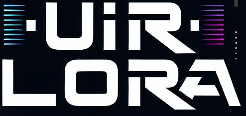
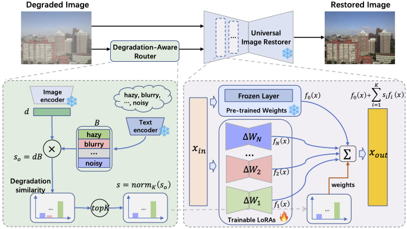

<div align="center">
  <p align="center">
    
</p>
<h2> 🏠 UIR-LoRA: Achieving Universal Image Restoration through Multiple Low-Rank Adaptation</h2>
  
[](https://arxiv.org/pdf/2409.20197<INDEX>) 


<p align="center">
    
</p>
</div>
<div>

## :new: Update

- **16/06/2024** Create the project page
- **30/09/2024** Submit the paper to Arxiv

## :gear: Installation

## :star: Train

## :star: Inference

## :

## Citation

Please cite us if our work is useful for your research.

```
@misc{zhang2024UIR-LoRA,
      title={UIR-LoRA: Achieving Universal Image Restoration through Multiple Low-Rank Adaptation}, 
      author={Cheng Zhang and Dong Gong and Jiumei He and Yu Zhu and Jinqiu Sun and Yanning Zhang},
      year={2024},
      eprint={},
      archivePrefix={arXiv},
      primaryClass={cs.CV}
}
```

## License

This project is released under the [Apache 2.0 license](LICENSE).

</div>
